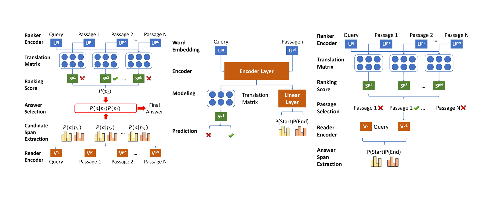

# Rank-and-Read

Our codes, experiment results and model checkpoints of our work *Bridging Neural Rankers and Machine Readers*

	
	

		<em>Experiment results</em>
	

## BiDAF Reader experiments

see `bidaf-exp` for details

## Bert Reader Experiments

see `bert-rar` for details
